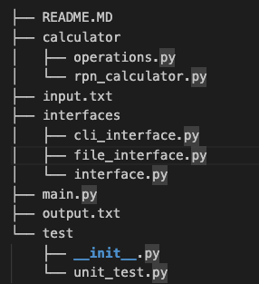
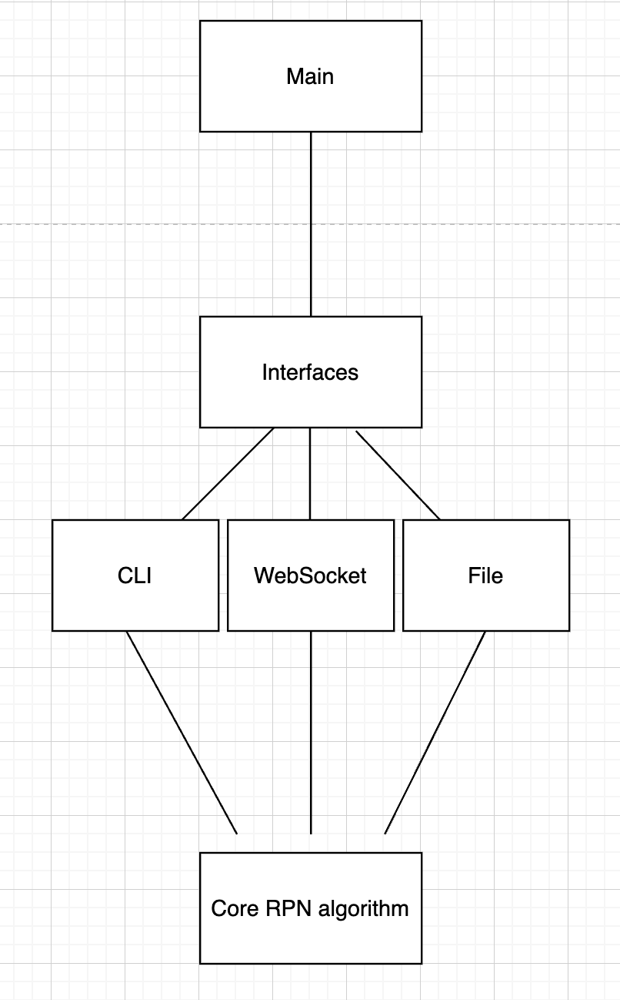

# RPN Calculator Service

A Reverse Polish Notation (RPN) calculator with multiple interface options.

## Overview

This program provides is an RPN calculator with:
- A command-line interface (CLI) for interactive use
- Extensible architecture design for additional interfaces (file I/O commented out)
- Comprehensive error handling
- 4 Basic arithmetic operations (+, -, *, /)

## Architecture




## Technical Reasoning

1. **Interface Abstraction**: 
   - The calculator logic is separated from how users interact with it (like CLI or WebSocket). This lets us add new interfaces easily without changing the main calculator code
   - Enables class to select an algorithm's implementation at run time (Strategy Pattern) in interface.py with `CalculatorInterface` python abstract class (ABC)

2. **RPN Calculator Implementation**:
   - This algorithm uses a stack as primary data structure to calculate expressions in RPN
   - If the token is a number, convert it to float and push it onto the stack
   - If the token is a valid operator (`+`, `-`, `*`, `/`), pop the top two numbers from the stack, apply the operator, and push the result back
   - Checks for valid numeric tokens and operators
   - Ensures there are enough operands on the stack before applying an operator
   - After processing all tokens, the value remaining on the stack is the final result

3. **Error Handling**:
   - Comprehensive input validation
   - Gracefully handles edge cases like division by zero and invalid input with clear error messages

## Trade-offs

1. **Current Limitations**:
   - Only CLI and file interface fully implemented
   - Basic operation set (no exponents, functions, etc.)
   - Limited input validation scope

2. **Future Improvements**:
   - Add additional operations
   - Implement different interfaces (WebSocket, TCP, etc.)
   - Add logging and monitoring
   - Configuration management

## Getting Started

### Prerequisites

- Python 3.7+
- pip

### Installation

1. **Clone the repository**  
   ```bash
   git clone https://github.com/bysj001/Snap-Mobile-CLI-RPN-Calculator.git
   cd Snap-Mobile-CLI-RPN-Calculator
   ```

### Running the Application

- **CLI Interface**
  ```bash
  python3 main.py --interface cli
  ```

### Running Tests

- This project uses Python's built-in `unittest` framework for testing the RPN calculator
- From the root directory run: python3 -m unittest test.unit_test